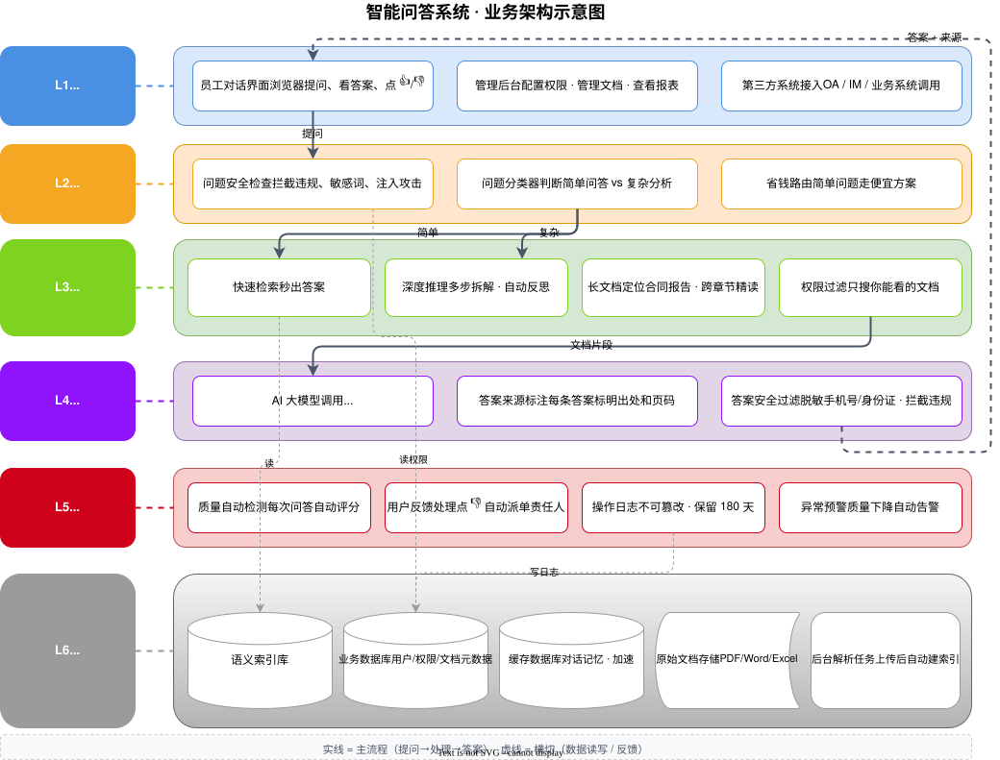

# 企业级 Agentic RAG 智能问答系统

> **项目介绍 · v1.0**
> Enterprise Agentic RAG Knowledge Q&A Platform · 一期 MVP

本文档面向评审和合作方，用几分钟讲清楚：项目要解决的业务问题、产品目标、业务与技术架构、核心模块、关键指标与里程碑。一篇读懂这套系统的能力边界与当前进展。

`一期 MVP` · `私有化部署` · `Agentic RAG` · `权限感知` · `全链路评估` · `模型无关`

> **目录速览**：① 项目概述 ② 背景与目标 ③ 业务架构 ④ 技术架构 ⑤ 核心模块 ⑥ 关键流程与逻辑 ⑦ 关键指标 ⑧ 里程碑与交付 ⑨ 一行示例 ⑩ 文档与术语。

---

## 1. 项目概述

本项目旨在构建一套**企业级、基于检索增强生成（RAG）的通用智能问答系统**。通过 *混合检索架构（直搜 + Agentic RAG）* 实现**高精度、可溯源、安全可控**的智能问答体验，覆盖文档解析、知识库管理、问答、评估、治理、安全等完整链路。

一期（phase1-mvp）目标是**端到端跑通 MVP**：可演示、可迭代、关键指标可观测；二期在 GraphRAG、CDC 同步、视频解析、动态权限、PDCA 闭环等方向扩展。

---

## 2. 项目背景与目标

### 2.1 业务痛点

随着企业知识资产规模持续增长，员工在日常工作中面临"信息过载"与"知识孤岛"的双重困境：

- 企业政策、产品手册等资料查找不便，咨询对接人耗时长；
- 文档分散在本地文件夹、网盘、邮件附件等多个位置，检索效率低；
- 传统关键词搜索无法理解语义，难以回答复杂业务问题；
- 大语言模型（LLM）存在幻觉风险，无法直接用于企业关键决策；
- 现有开源/商业方案在质量评估、数据治理、数据安全、成本可控性方面存在明显短板。

### 2.2 产品目标

| 维度 | 描述 |
|---|---|
| **精准问答** | 多格式深度解析 + 混合检索，准确率行业领先 |
| **可信溯源** | 每条答案标注来源段落，可审计、可验证 |
| **智能协作** | 多智能体协作，复杂问题自动拆解、多跳推理 |
| **安全合规** | 数据驻留、权限感知、输出过滤、审计可追溯 |
| **成本可控** | 按问题复杂度路由通道，避免不必要的 Token 消耗 |
| **持续进化** | 全链路评估 + Drift Alarm 驱动系统迭代 |

### 2.3 目标用户

| 角色 | 典型用途 |
|---|---|
| 普通员工（Users） | 查询政策、产品手册、合同、分析报告、技术规范、历史项目文档 |
| 业务专家 / 文档责任人（DocOwner） | 维护知识库质量，处理用户反馈 |
| 知识库管理员（KnowledgeAdmin） | 配置监控健康度、审核 Bad Case、生成治理报告 |
| IT / 安全管理员（SecurityAdmin） | 查看审计日志、配置数据驻留策略、确保输出安全 |
| 企业决策者（Leadership） | 查看统计报告、准确率趋势、用户满意度 |

---

## 3. 业务架构

业务架构自上而下分为 **5 个能力层**：用户交互层 → 智能路由层 → 检索引擎层 → 生成输出层 → 评估与治理层。每一层各司其职，又通过统一的审计与评估"横切层"贯通全链路。



*图 1 · 业务架构全景（来源：`business-architecture.svg`）*

### 3.1 五大能力层职责

| 层级 | 能力 | 关键产物 |
|---|---|---|
| 用户交互层 | Web Chat UI、管理后台、REST / SDK | 问答界面、文档管理、反馈查看、评估看板 |
| 智能路由层 | 问题分类器 + 成本路由决策 | 简单/复杂/精确三分类，路由到最优通道 |
| 检索引擎层 | 直搜通道、Agentic RAG、权限感知过滤 | 向量+BM25+Rerank、LangGraph 多跳推理、ACL Pre-filter |
| 生成输出层 | LLM 网关、引用溯源、输出过滤 / 脱敏 | 带引用的答案、敏感词过滤、隐私脱敏 |
| 评估与治理层 | 全链路评估、审计日志、数据治理 | RAGAS 指标、WORM 审计、反馈闭环 |

---

## 4. 技术架构

技术架构沿用业务架构的 5 层模型，并在底层叠加**横切层**（审计、评估、监控）。关键设计原则：

- **私有化部署**：所有数据（文档、索引、日志、模型缓存）不出域，Docker Compose 单机起步；
- **模型无关**：业务代码只调 LiteLLM HTTP API，切换 LLM 仅改环境变量 `LITELLM_MODEL`，兼容 Kimi、Qwen、DeepSeek、GPT、本地 Ollama / vLLM 等；
- **解析与切片解耦**：格式分发器（`parser_router`）仅产出结构化 ParsedDoc，独立的 `chunker` 完成语义+层级切片，避免单一组件膨胀；
- **检索阶段权限过滤**：Qdrant payload pre-filter 在向量召回时就过滤无权文档，而非事后在 UI 层遮罩，从根本上防止提示词注入导致信息泄露；
- **输入 / 输出双层合规**：用户 query 必经 `query-guardrail`，LLM 输出再经 `post-processor`，命中规则时拒绝或脱敏。

### 4.1 核心技术栈

| 类别 | 选型 | 理由 |
|---|---|---|
| LLM 网关 | LiteLLM | OpenAI 兼容、模型路由、缓存与成本追踪 |
| 向量库 | Qdrant | 支持 payload pre-filter、BM25 hybrid |
| Agent 编排 | LangGraph | 图状态机、Checkpointer、多跳与反思 |
| 文档解析 | 格式分发器（5 × text_extractors）+ DeepDoc Server :9390 | 常见格式零依赖，复杂/扫描件走视觉路径 |
| 关系库 | PostgreSQL + SQLAlchemy + Alembic | 元数据 / 审计 / 反馈 / 评估落库 |
| 缓存 / 队列 | Redis + Celery | 会话缓存、批量导入、限流 |
| Web 后端 | FastAPI + Uvicorn | 异步、类型驱动、OpenAPI 自动生成 |
| Web 前端 | Vue 3 + Vite + Element Plus + Pinia | 团队熟悉度高、生态完善 |
| 评估 | RAGAS + DeepEval | 检索 / 生成 / 忠实度 / 引用准确率指标 |
| 监控 | Prometheus + Grafana | 指标采集、Drift Alarm、评估看板 |

---

## 5. 核心模块

### 5.1 文档解析（doc-processor）

文档入库链路的起点。支持 TXT / PDF（文本型 & 扫描件 OCR）/ Word / Excel / PPT / 图片（P1）。内部采用**格式分发器（parser_router）**：常见格式（PDF 文本层、DOCX、PPTX、XLSX、MD、TXT）由 `text_extractors` 直接抽取，零外部依赖；扫描件 / 复杂图像走 `visual_router`，调用独立的 DeepDoc Server（LitServe，`:9390`）提供的 `/predict/{dla,ocr,tsr}`，失败时降级到 RapidOCR。

### 5.2 切片与索引（chunker + indexer）

`chunker` 独立完成语义+层级切片：**父 chunk** 章节级（用于先定位）、**子 chunk** 段落级（用于精排与引用）。向量化后写入 Qdrant，payload 携带 `doc_id / workspace_id / acl / page_no / position` 等元数据，元数据（文档状态、责任人、权威等级等）落 PostgreSQL。

### 5.3 直搜通道（retrieval-direct）

简单事实查询的默认通道。**向量语义 + BM25 关键词 + Rerank** 三路混合，结果经 Rerank 重排后送入生成。长文档采用两阶段策略：先定位父 chunk（章节级），再在子 chunk（段落级）精排；128K 长上下文模型仅作 fallback（score < 阈值时由 LiteLLM 路由触发）。

### 5.4 Agentic RAG（agent-core）

复杂多跳问题的求解通道。基于 **LangGraph** 图状态机实现：

1. **Plan 节点**：拆解子查询，生成执行计划；
2. **Retrieve 节点 × N**：多轮检索（调 `retrieval-direct`）；
3. **Reflect 节点**：评估检索质量，不足则改写 / 切换数据源；
4. **Generate 节点**：调用 LiteLLM 生成；
5. **Post-Processor**：输出过滤与脱敏；
6. 最大迭代次数 ≤ 5（可配置），防止无限循环与 Token 失控。

### 5.5 问题分类与成本路由（router）

分类器判断问题类型（`simple / complex / exact`），路由策略可配置：

- **简单事实** → 直搜（目标 P95 < 500ms，低成本）；
- **复杂多跳** → Agentic RAG（带工具调用、多轮推理）；
- **精确数值** → 结构化数据查询（NL2SQL / API 调用）；
- 单次查询可设置 Token 预算熔断（默认 10K），超限自动降级或返回"建议拆分"。

### 5.6 引用溯源与答案生成（generator）

答案生成后，每个事实点附带 `chunk_id` + 文档名 + 段落号，前端点击可跳转原文。引用准确率纳入评估体系，要求 ≥ 95%。可选地为答案打"高可信 / 需核实"标签（P1）。

### 5.7 全链路评估（evaluation）

评估指标覆盖"检索 → 生成 → 用户反馈"全链路：

| 阶段 | 关键指标 | 目标 |
|---|---|---|
| 检索 | Recall@K / Precision@K / Context Relevance / MRR | ≥ 0.85 |
| 生成 | Faithfulness / Answer Relevance / Citation Accuracy / Hallucination Rate | ≥ 0.85，引用准确率 ≥ 95%，幻觉率 ≤ 10% |
| 反馈 | 用户满意度 CSAT、反馈归类准确率 | ≥ 80% 自动归类 |
| 告警 | Drift Alarm | 连续 7 天某类问题准确率下降 > 5% 自动触发 |

### 5.8 安全与权限（auth-acl + rbac + guardrail + audit）

- **ACL（文档级）**：读 / 写 / 管理权限，默认继承上传者；
- **Workspace 隔离**：不同部门 / 项目逻辑隔离；
- **RBAC（角色级）**：6 种内置角色（workspace_admin / kb_admin / doc_owner / chat_user / system_admin + auditor 弃用）+ 自定义角色 + 按 workspace 维度分配；全局超管走 `users.is_super_admin`；
- **输入合规（query-guardrail）**：用户 query 提交至 LLM 之前必经敏感词 / prompt injection / 个人信息检查；
- **输出过滤（post-processor）**：敏感词命中返回拒绝话术，个人隐私 / 商业敏感数据自动脱敏（如 `138****8888`）；
- **审计日志**：每次问答完整链路（用户身份、查询内容、检索文档、模型、Token、响应时间、引用源）保留 ≥ 180 天，WORM 防篡改。

---

## 6. 关键流程与逻辑

### 6.1 文档入库链路

```
用户上传 ─→ 写入 PostgreSQL (status=pending)
              │
              ▼
        Celery 异步任务触发
              │
              ▼
   parser_router (格式分发)
      ├─ 文本型 PDF / DOCX / PPTX / XLSX / TXT → text_extractors
      └─ 扫描 PDF / 复杂图像 → DeepDoc Server :9390 (/predict/{dla,ocr,tsr})
                                  └ 失败时降级 RapidOCR
              │
              ▼
   chunker 语义+层级切片 (父 chunk 章节级 + 子 chunk 段落级)
              │
              ▼
   Embedding 向量化 ─→ 写入 Qdrant (payload 携带 doc_id / workspace_id / acl)
              │
              ▼
   PostgreSQL 状态置为 ready ─→ 前端可检索
```

### 6.2 用户提问链路（以"复杂多跳"为例）

```
用户问题
   │
   ▼
[API Gateway] ─── 鉴权 ─── 写入 [Audit Log 起]
   │
   ▼
[Query Guardrail] ─── 输入合规 ─── 不通过则拒绝并记录审计
   │
   ▼
[Router] ── 分类:复杂 ──→ [Agent Core]
   │                              │
   │                              ▼
   │                       [Plan Node] 拆解子查询
   │                              │
   │                              ▼
   │                       [Retrieve Node] × N  (调 Retrieval Direct)
   │                              │
   │                              ▼
   │                       [Reflect Node] 评估检索质量
   │                              │
   │                              ▼
   │                       [Generate Node] 调用 LiteLLM 生成
   │                              │
   │                              ▼
   │                       [Post-Processor] 过滤/脱敏
   │                              │
   │                              ▼
   └──────────→ 返回答案 + 引用 chunk_id
                          │
                          ▼
                  [Audit Log 终] · [Feedback 收集就绪]
```

### 6.3 多轮对话与反馈闭环

- **多轮记忆**：会话状态由 Redis 短期保存 + LangGraph Checkpointer 持久化，支持指代消解（如"刚才那份文档的第三章说了什么"）；
- **追问引导（P1）**：答案尾部推荐 3–5 个相关问题；
- **反馈闭环**：每轮对话后用户可 👍 / 👎 + 原因标签，反馈经 LLM 自动归类（检索 / 切片 / 生成 / 知识库 / 用户问题），结果进入评估看板与 Bad Case Top 10。

---

## 7. 关键非功能指标

| 维度 | 指标 | 目标 |
|---|---|---|
| 性能（直搜） | P95 响应时间 | ≤ 2s |
| 性能（Agentic） | P95 响应时间（含多轮推理） | ≤ 10s |
| 并发 | 同时在线用户数 | ≥ 200 |
| 解析吞吐 | 单节点处理能力 | ≥ 100 页/分钟 |
| 索引构建 | 批量导入速度 | ≥ 500 文档/小时 |
| 可用性 | 年停机时间 | ≥ 99.9%（< 8.76h/年） |
| 故障恢复 | RTO / RPO | ≤ 30min / ≤ 1h |
| 索引重建 | 10 万文档全量 | ≤ 4h |
| 模型无关 | 切换 LLM 是否改业务代码 | 不改，仅改 `LITELLM_MODEL` |
| 部署 | 一键起停 | Docker Compose |

---

## 8. 里程碑与交付

| # | 里程碑 | 交付物 | 验收口径 |
|---|---|---|---|
| M1 | 基础设施 + 文档解析 | Compose 起栈 / 5 格式解析 / Qdrant 索引 / PG 元数据 | 上传文档 → 可检索 |
| M2 | 直搜通道 + 引用溯源 | 检索 API / Rerank / 引用标注 / 多轮记忆 | 简单问题端到端跑通 |
| M3 | Agentic RAG + 意图识别 | LangGraph 编排 / 工具注册 / 反思修正 / 路由决策 | 复杂问题端到端跑通 |
| M4 | 评估 + 反馈 + 治理 | RAGAS/DeepEval / 反馈采集 / 自动归类 | 评估数据可见、可分析 |
| M5 | 安全 + 权限 + 审计 | RBAC + ACL + Guardrail + 审计日志 | 权限与合规测试通过 |
| M6 | Web UI + 管理后台 + 看板 | 聊天界面 / 文档管理 / 反馈查看 / Grafana 看板 | 全栈演示 |

一期 MVP 当前进展：M1–M5 全部闭环（ M5 安全收官 + 729/1/7 测试基线），M6 前端分 T6.1（已闭环）/ T6.2+（进行中）。

---

## 9. 一行示例

下面给出一个最简单的提问调用，便于读者看到产品形态（仅作示例，不代表全部参数）：

```bash
# 1) 提问
curl -X POST http://localhost:8000/api/v1/chat/query \
  -H "Authorization: Bearer <token>" \
  -H "Content-Type: application/json" \
  -d '{
        "workspace_id": "<uuid>",
        "question": "公司年假政策是怎么规定的？",
        "stream": false
      }'

# 2) 反馈（👍 / 👎 + 原因）
curl -X POST http://localhost:8000/api/v1/feedback \
  -H "Authorization: Bearer <token>" \
  -H "Content-Type: application/json" \
  -d '{
        "message_id": "<uuid>",
        "score": -1,
        "reason_tag": "answer_wrong"
      }'
```

---

## 10. 文档与术语

### 10.1 配套文档

- 产品需求：`Product_Design/企业级Agentic_RAG智能问答系统_PRD.docx`
- 需求对齐：`docs/phase1-mvp/ALIGNMENT_phase1-mvp.md`
- 共识与方案：`docs/phase1-mvp/CONSENSUS_phase1-mvp.md`
- 架构设计：`docs/phase1-mvp/DESIGN_phase1-mvp.md`
- 任务拆分：`docs/phase1-mvp/TASK_phase1-mvp.md`
- 验收报告：`docs/phase1-mvp/ACCEPTANCE_phase1-mvp.md`
- 业务架构图：`docs/architecture/business-architecture.svg`
- 系统架构图：`docs/architecture/System-architecture.svg`
- README：`README.md`

### 10.2 关键术语

| 术语 | 解释 |
|---|---|
| RAG | Retrieval-Augmented Generation，检索增强生成 |
| Agentic RAG | 具备自主规划、工具调用、多跳推理能力的智能体增强检索 |
| 直搜 | 基于向量语义检索 + BM25 关键词检索的混合检索模式 |
| 权限感知检索 | 在检索阶段即过滤用户无权访问的文档片段，而非 UI 层过滤 |
| Chunk | 文档切片后的最小语义单元 |
| Workspace | 逻辑隔离的知识库单元，对应部门、项目或租户 |
| GraphRAG（二期） | 基于知识图谱的检索增强生成，实体-关系-社区摘要实现全局洞察 |

---

*本文档版本 v1.0（2026-06-23）。内容以 `Product_Design/企业级Agentic_RAG智能问答系统_PRD.docx` 与 `docs/phase1-mvp/CONSENSUS_phase1-mvp.md` 为单一事实来源，后续随项目迭代更新。*
